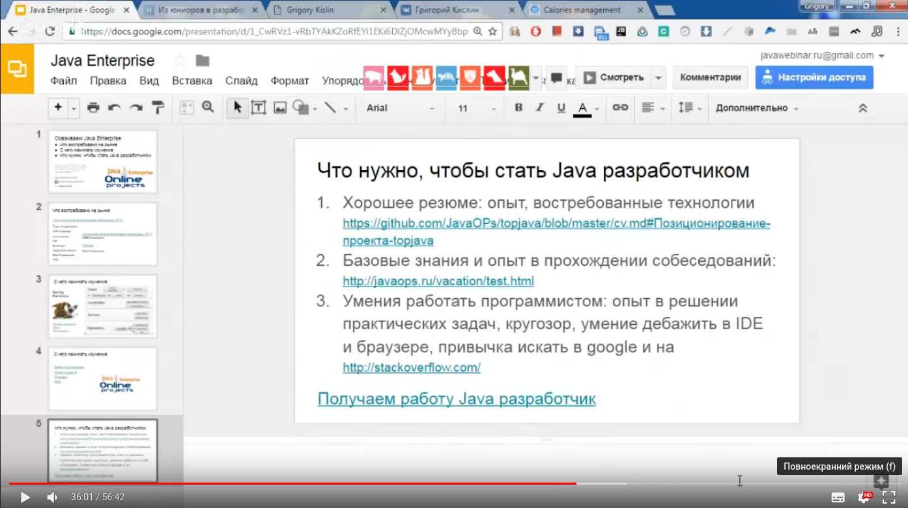

# <center>Java Enterprise Online Project</center>  
Разработка полнофункционального Spring/JPA Enterprise приложения c авторизацией и правами доступа на основе ролей с использованием наиболее популярных инструментов и технологий Java:  
   
Maven, Spring MVC, Security, JPA(Hibernate), REST(Jackson), Bootstrap (css,js), datatables, jQuery + plugins, Java 8 Stream and Time API и хранением в базах данных Postgresql и HSQLDB.


>*Когда вы слышите что-то, вы забываете это.*
*Когда вы видите что-то, вы запоминаете это.*
*Но только когда вы начинаете делать это,*
*Вы начинаете понимать это*
> 
 >##### **Старинная китайская поговорка**

### [Описание и план проекта](https://github.com/JavaOPs/topjava/blob/master/description.md)
### [Демо разрабатываемого приложения](http://topjava.herokuapp.com/)
### [Изменения проекта (Release Notes)](https://github.com/JavaOPs/topjava/blob/master/ReleaseNotes.md)
### [Требования к участникам, Wiki](https://github.com/JavaOPs/topjava/wiki)
### [Составление резюме, подготовка к интервью, поиск работы](https://github.com/JavaOPs/topjava/blob/master/cv.md)

# <center>ВВОДНОЕ ЗАНЯТИЕ</center>  
```diff
! Все видео обязательны к просмотру
```

[](https://drive.google.com/file/d/0B9Ye2auQ_NsFY1ZDNXRCd1NCTG8/edit)
